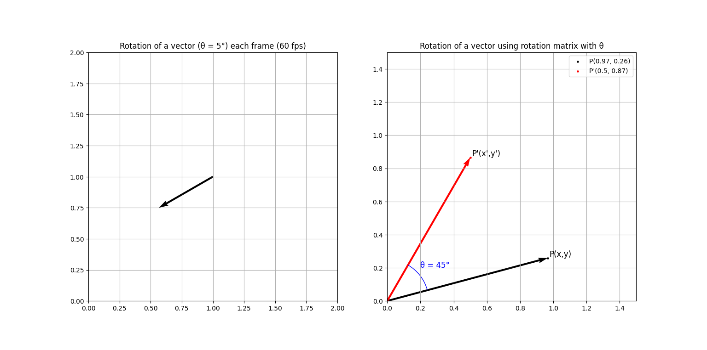

# Vector Rotation using Rotation Matrix

This project demonstrates the **rotation of a vector** in a 2D plane using a **rotation matrix**. It visualizes how a vector rotates step-by-step by an angle of 5° per frame, with the use of **Matplotlib**'s animation functionality.

## Description:
In this visualization, we show two main components:
1. **Real-time vector rotation**: A vector starts from an initial position and is rotated incrementally by 5° each frame, resulting in smooth, continuous motion.
2. **Illustrative Diagram**: A static plot shows how the rotation matrix is applied to rotate a vector by a given angle. It demonstrates the mathematical operation in action by rotating a point using a **θ = 45° rotation matrix**.

## Rotation Matrix

The rotation matrix R(θ) is given by:

$$
R(\theta) = \begin{bmatrix} 
\cos{\theta} & -\sin{\theta} \\
\sin{\theta} & \cos{\theta}
\end{bmatrix}
$$

## Example:
If the original point is $\mathbf{P}(1, 0 \)$ and we rotate it by $\theta = 45^\circ = \frac{\pi}{4} \ \text{radians}$, we can use the rotation matrix to calculate the new point $\mathbf{P'}$:

1. **Apply the rotation matrix**:

$$
\mathbf{P'} = \begin{bmatrix} 
\cos{\frac{\pi}{4}} & -\sin{\frac{\pi}{4}} \\
\sin{\frac{\pi}{4}} & \cos{\frac{\pi}{4}}
\end{bmatrix}
\cdot 
\begin{bmatrix} 1 \\
0 \end{bmatrix} = \begin{bmatrix} 
   \frac{\sqrt{2}}{2} \\
   \frac{\sqrt{2}}{2}
   \end{bmatrix}
$$

2. **Therefore, the new point is approximately**:

$$
\mathbf{P'} \approx (0.707, 0.707)
$$


## Diagrams:

The diagram shows the rotation of the vector and the rotation matrix in action.

## Install - using Git
1. Clone the repository:
   ```bash
   git clone https://github.com/BogdanVlad06/Rotation-Matrix-aplication/tree/main

2. To setup virtual environment:
   ```bash
   python -m venv venv
   venv\Scripts\activate
3. Install dependencies:
   ```bash
   pip install -r requirements.txt
